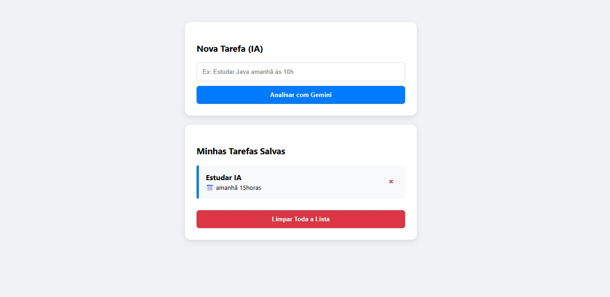

Markdown
# 🤖 Projeto IA - Organizador de Tarefas Inteligente

Este é um projeto Fullstack que utiliza a API do **Google Gemini 3** para processar linguagem natural e organizar listas de tarefas automaticamente. 

O sistema permite que o utilizador digite frases informais e a inteligência artificial extraia o título da tarefa e o prazo de entrega de forma estruturada.

---

## 📸 Demonstração do Projeto

Abaixo pode ver a interface do sistema a processar uma entrada e a guardar na lista de tarefas:



---

## 🚀 Funcionalidades

* **Processamento de Linguagem Natural**: Utiliza o modelo `gemini-3-flash-preview` para entender as intenções do utilizador.
* **Extração de Dados**: Transforma frases como "estudar java amanhã" num objeto JSON estruturado com tarefa e data.
* **Persistência Local**: Guarda as tarefas confirmadas no `localStorage` do navegador, mantendo os dados mesmo após atualizar a página.
* **Gestão de Tarefas**: Permite visualizar a lista de afazeres e limpar o histórico completo.

---

## 🛠️ Tecnologias Utilizadas

### Backend
* **Node.js**: Ambiente de execução.
* **Express**: Framework para o servidor web e rotas da API.
* **Dotenv**: Gestão de variáveis de ambiente e segurança da API Key.

### IA
* **Google Gemini API**: Motor de inteligência artificial generativa.

### Frontend
* **HTML5 / CSS3**: Estrutura e estilização da interface.
* **JavaScript Vanilla**: Lógica de comunicação com o backend e manipulação do DOM.

---

## 📂 Estrutura de Pastas

O projeto foi organizado para manter o código-fonte separado das evidências visuais:

* `projeto_ia/`: Contém todo o código do servidor Node.js e ficheiros web.
* `screenshots/`: Armazena as imagens de demonstração do funcionamento da app.

---

## 🔧 Como Executar o Projeto

Para correr o projeto localmente, abra o terminal e siga estes passos simples:

```bash
# 1. Clone o repositório e entre na pasta
git clone [https://github.com/rogrodr/projeto-ia.git](https://github.com/rogrodr/projeto-ia.git)
cd projeto_ia

# 2. Instale as dependências
npm install
Configuração da API:
Crie um ficheiro chamado .env dentro da pasta projeto_ia e coloque a sua chave do Gemini:
GEMINI_API_KEY=A_SUA_CHAVE_AQUI

Iniciar o servidor:
node index.js
Por fim, aceda a http://localhost:3000 no seu navegador para utilizar a aplicação.

Desenvolvido por rogrodr em 2026.